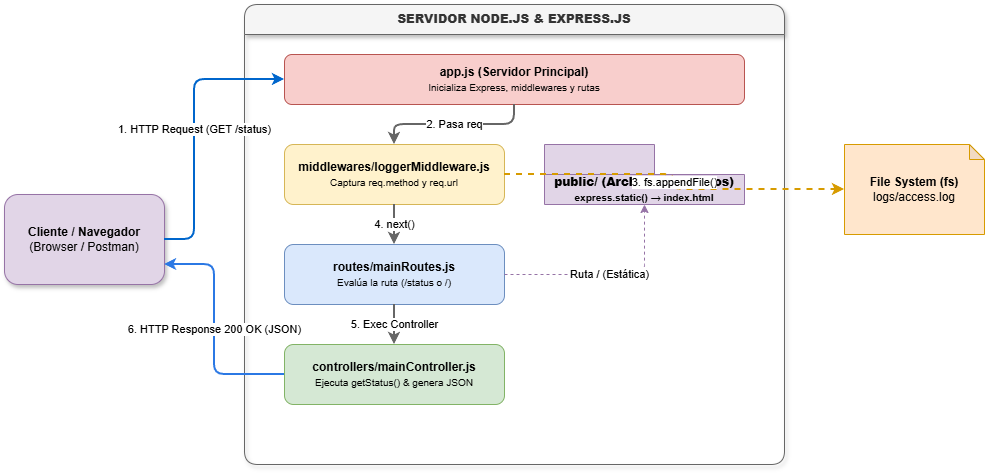

# Aplicación Web Node.js + Express 

Servidor web desarrollado con Node.js y Express.js que abarca desde la creación del servidor base, sirviendo contenido estático y dinámico, hasta la persistencia en archivos planos y la modularización bajo el patrón MVC (Modelo-Vista-Controlador).

---

## 📋 Resumen del Desarrollo por Lecciones

### Lección 1: Conociendo Node y Express
* **Ecosistema Node.js:** Node.js es un entorno de ejecución (*runtime*) de JavaScript del lado del servidor construido sobre el motor V8 de Google Chrome. Permite desarrollar aplicaciones backend escalables, no bloqueantes y orientadas a eventos.
* **Beneficios de Express sobre Node puro:** Express.js aporta un marco de trabajo (*framework*) minimalista que simplifica significativamente la gestión del enrutamiento HTTP, el manejo de *middlewares*, la parseación de solicitudes y la integración con motores de plantillas, evitando escribir código verboso con los módulos HTTP nativos de Node.js.
* **Flujo Básico Servidor–Cliente:**




#### Infografía del Stack Técnico (Tarea PLUS)
* **Runtime:** Node.js
* **Framework Backend:** Express.js
* **Motor de Plantillas:** Handlebars (HBS)
* **Persistencia:** Archivos planos (`fs/promises`)
* **Gestión de Entorno:** `dotenv`
* **Herramientas de Desarrollo:** Nodemon

---

### Lección 2: Instalación y Configuración de Node
* **Nombre del archivo principal:** Se eligió el nombre `app.js` como punto de entrada del servidor para seguir la convención estándar de la industria en aplicaciones Express.
* **Variables de Entorno:** Se implementó la librería `dotenv` para abstraer la configuración del puerto (`PORT`) mediante un archivo local `.env`, evitando exponer credenciales o valores sensibles en el código fuente.

---

### Lección 3: Gestión de Paquetes en Node
* **Dependencias Instaladas:**
  * `express`: Framework backend principal.
  * `dotenv`: Carga de variables de entorno desde `.env`.
  * `hbs`: Motor de plantillas dinámicas.
  * `nodemon` (como `devDependency`): Reinicio automático del servidor ante cambios en el código durante el desarrollo.
* **Scripts en `package.json`:**
  * `npm start`: Ejecuta `node app.js` para entornos de producción.
  * `npm run dev`: Ejecuta `nodemon app.js` para agilizar la etapa de desarrollo.

---

### Lección 4: Sirviendo Contenido Web
* **Archivos Estáticos (`/public`):** Se utilizó el middleware `express.static('public')` para servir el documento estático `index.html` maquetado con Bootstrap 5.
* **Respuestas JSON y HTML:** Se configuraron las rutas `/` (HTML estático) y `/status` (JSON).
* **Vista Dinámica (Tarea PLUS):** Se configuró el motor **Handlebars (HBS)** (`app.set('view engine', 'hbs')`) para inyectar datos dinámicos en la ruta `/vistaDinamica` mediante la vista `views/index.hbs`.

---

### Lección 5: Persistencia en Archivos Planos
* **Registro de Logs de Acceso:** Se desarrolló un helper dedicado (`helpers/logHelper.js`) que hace uso de la API asíncrona `fs.appendFile()` (`fs/promises`) para almacenar cada visita web en `logs/access.log`.
* **Estructura del Registro:** Cada acceso almacena el parámetro de fecha y hora ISO, el método HTTP utilizado y la ruta accedida[cite: 2, 4]:
  ```text
  [2026-09-05T20:30:00.123Z] METODO: GET | RUTA: /
  [2026-09-05T20:30:04.456Z] METODO: GET | RUTA: /status
  [2026-09-05T20:30:08.789Z] METODO: GET | RUTA: /dinamico

---

## 📁 Estructura del Proyecto

```text
.
├── controllers/
│   └── mainController.js   # Lógica de procesamiento y respuestas para cada ruta
├── helpers/
│   └── logHelper.js        # Módulo de interacción asíncrona con el File System
├── logs/
│   └── access.log          # Historial plano de peticiones HTTP en tiempo real
├── middlewares/
│   └── loggerMiddleware.js # Middleware de interceptación y registro de accesos
├── public/
│   ├── index.html          # Documento HTML estático estilizado con Bootstrap 5
│   └── flujo-servidor-cliente.png # Diagrama visual del flujo cliente-servidor
├── routes/
│   └── router.js           # Enrutador modular de Express (Express Router)
├── views/
│   └── index.hbs           # Plantilla dinámica en Handlebars
├── .env.example            # Plantilla de variables de entorno
├── .gitignore              # Exclusión de node_modules, .env y logs
├── app.js                  # Punto de entrada principal de la aplicación
├── package.json            # Configuración de dependencias y scripts de NPM
└── README.md               # Documentación completa del proyecto